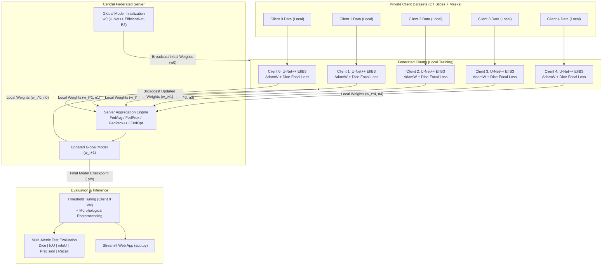

# Federated Learning-Based Lung Nodule Segmentation Using U-Net++ with EfficientNet-B3

[](https://www.python.org/)
[](https://pytorch.org/)
[](https://monai.io/)
[]()
[]()

> A research-oriented framework for privacy-preserving federated lung nodule segmentation from thoracic CT scans using U-Net++ with an ImageNet-pretrained EfficientNet-B3 encoder.

---

## 1. Overview

Lung nodule segmentation from computed tomography (CT) imaging is a foundational diagnostic task in pulmonary oncology and computer-aided detection (CAD) pipelines. Accurately delineating nodule morphology provides critical volumetric and boundary cues for malignancy risk stratification, biopsy guidance, and longitudinal treatment monitoring. However, manual nodule delineation is labor-intensive, time-consuming, and subject to inter-radiologist variability.

While deep semantic segmentation networks achieve high diagnostic precision, centralized training requires aggregating sensitive thoracic CT datasets at a single repository. In healthcare systems, raw medical data consolidation is severely restricted by institutional privacy governance, data security compliance, and healthcare regulations.

**Federated Learning (FL)** addresses this fundamental barrier by decoupling model training from direct data collection. Participating institutional nodes retain custody of their raw patient scans locally and only exchange parameter weights or gradients with a central server.

This project investigates federated lung nodule segmentation by combining:
* **U-Net++**: An advanced segmentation architecture featuring nested, dense skip pathways that reduce the semantic disparity between encoder and decoder sub-networks.
* **EfficientNet-B3**: A compound-scaled backbone pre-trained on ImageNet, providing rich multi-scale hierarchical feature extraction while preserving computational efficiency.
* **Federated Optimization Benchmarking**: A comparative evaluation across four federated aggregation strategies—**FedAvg**, **FedProx**, **FedProx++**, and **FedOpt (FedAdam)**—under non-IID client distributions.

---

## 2. Key Features

* **Privacy-Preserving Distributed Training**: Raw thoracic CT slices remain strictly localized on client nodes; only model parameter updates are transmitted.
* **U-Net++ Architecture**: Dense nested skip connections bridge multi-resolution feature maps to accurately delineate subtle nodule boundaries.
* **EfficientNet-B3 Encoder**: Pretrained compound-scaled feature extraction network that balances representational capacity and parameter efficiency.
* **Dice-Focal Loss Formulation**: Joint loss objective specifically designed to counteract severe foreground-background voxel imbalance in thoracic CT imaging.
* **Federated Optimization Comparison**: Comprehensive empirical study across **FedAvg**, **FedProx**, **FedProx++**, and **FedOpt (FedAdam)**.
* **Post-Training Inference Calibration**: Validation-guided decision threshold tuning combined with morphological postprocessing (hole filling, connected-component area filtering).
* **Multi-Metric Evaluation**: Rigorous evaluation reporting Dice Similarity Coefficient (DSC), Intersection over Union (IoU), Mean IoU (mIoU), Precision, and Recall.
* **Interactive Inference Application**: Streamlit-based interface (`app.py`) for single-slice CT nodule segmentation and contour overlay.

---

## 3. Architecture & Workflow

The federated training pipeline coordinates local client model updates and centralized server-side aggregation across iterative communication rounds.



> **Privacy Guarantee**: Patient CT slices and ground-truth nodule masks never leave their respective client environments. Only localized model weights ($w_t^k$) and sample counts ($n_k$) are shared with the central server.

---

## 4. Dataset

The project utilizes thoracic CT scans and corresponding binary lung nodule masks derived from the **LUNA16 (LIDC-IDRI)** benchmark:

* **Source Dataset**: LUNA16 Segmentation Data (derived from LIDC-IDRI).
* **Modalities**:
  * **CT Images**: 2D axial grayscale CT slices stored as `.png` files in the `ct/` directory.
  * **Nodule Masks**: Ground-truth binary segmentation masks stored as `.png` files in the `mask/` directory.
* **Resolution**: Standardized to $256 \times 256$ pixels.
* **Intensity Range**: Pixel values normalized to $[0.0, 1.0]$.
* **Client Distribution**: Partitioned across 5 simulated federated client nodes with a fixed 70% train, 15% validation, and 15% testing split per client.
* **Exact Slice Counts**: Subject to local disk/drive dataset subset; partitioned uniformly via randomized index splitting (`split_clients`) with random seed 42.

---

## 5. Preprocessing Pipeline

### Implemented Preprocessing
1. **Grayscale Loading**: CT slices and masks loaded via OpenCV (`cv2.IMREAD_GRAYSCALE`).
2. **Spatial Resampling**: CT slices resized to $256 \times 256$ pixels using bilinear interpolation; masks resized using nearest-neighbor interpolation to preserve discrete boundary labels.
3. **Intensity Normalization**: Pixel intensities scaled linearly from $[0, 255]$ to $[0.0, 1.0]$.
4. **Mask Binarization**: Target masks binarized via thresholding ($\text{mask} > 127 \rightarrow 1.0$).
5. **Tensor Formatting**: Formatted into single-channel float tensors with dimensions `[1, 256, 256]`.
6. **Inference Postprocessing**:
   * **Connected Component Filtering**: Removes small spurious false-positive predictions with pixel area $< 2$.
   * **Morphological Hole Filling**: Fills enclosed internal holes in predicted nodule contours using contour extraction and filling (`cv2.drawContours`).

### Planned / Future Preprocessing
* Full 3D volumetric patch extraction with isotropic voxel spacing resampling ($1 \times 1 \times 1\text{ mm}^3$).
* Hounsfield Unit (HU) windowing tailored to lung parenchyma (e.g., $[-1000, 400]\text{ HU}$).
* Multi-institutional domain adaptation and histogram equalization.

---

## 6. Model Architecture

The segmentation backbone utilizes **U-Net++** with an ImageNet-pretrained **EfficientNet-B3** encoder from `segmentation-models-pytorch`.

| Component | Specification |
| :--- | :--- |
| **Architecture** | U-Net++ (Nested and Dense Skip Connections) |
| **Encoder Backbone** | EfficientNet-B3 |
| **Encoder Pretraining** | ImageNet (`encoder_weights="imagenet"`) |
| **Input Channels** | 1 (Grayscale Thoracic CT Slice) |
| **Output Classes** | 1 (Binary Lung Nodule Segmentation) |
| **Input Dimension** | $1 \times 256 \times 256$ |
| **Decoder Channels** | (256, 128, 64, 32, 16) |
| **Skip Pathways** | Dense nested convolutional blocks bridging multi-scale levels |
| **Activation** | Sigmoid (probability output map) |
| **Loss Function** | Dice-Focal Loss (combining region-based Dice loss and distribution-based Focal loss) |

### Why U-Net++ with EfficientNet-B3?
* **Nested Dense Pathways**: Standard U-Net fuses feature maps of disparate semantic scales directly via skip connections. U-Net++ introduces intermediate dense convolution blocks that gradually reconcile semantic feature levels before concatenation.
* **EfficientNet-B3 Backbone**: Utilizes compound scaling (depth, width, and resolution) to extract high-level feature representations with fewer parameters than standard ResNet or VGG alternatives.

---

## 7. Federated Learning Pipeline

The federated training protocol coordinates distributed optimization over 50 communication rounds:

1. **Global Model Initialization**: The server initializes global parameters $w_0$ of the U-Net++ model.
2. **Distribution**: Global parameters $w_t$ are broadcast to all $K = 5$ participating client nodes.
3. **Local Client Optimization**: Each client trains locally for $E = 2$ epochs using its private training loader and local optimizer:
   * **FedAvg**: Standard local AdamW gradient descent minimizing $\mathcal{L}_{\text{DiceFocal}}$.
   * **FedProx**: Local objective augmented with a proximal term:
     $$\mathcal{L}_{\text{FedProx}}(w) = \mathcal{L}_{\text{DiceFocal}}(w) + \frac{\mu}{2} \|w - w_t\|^2$$
   * **FedProx++**: Uses a round-dependent decaying proximal coefficient $\mu_t = \mu_0 \cdot \gamma^t$ alongside gradient norm clipping ($\|\nabla w\|_2 \le 1.0$).
   * **FedOpt (FedAdam)**: Standard local client update; client weights returned to server for adaptive aggregation.
4. **Weight Upload**: Clients upload updated model states $w_{t+1}^k$ and local dataset sizes $n_k$ to the server.
5. **Server Aggregation**:
   * **FedAvg / FedProx / FedProx++**:
     $$w_{t+1} = \sum_{k=1}^K \frac{n_k}{N} w_{t+1}^k \quad \text{where } N = \sum_{k=1}^K n_k$$
   * **FedOpt (FedAdam)**: Computes aggregate pseudo-gradient:
     $$\Delta_t = \sum_{k=1}^K \frac{n_k}{N} (w_{t+1}^k - w_t)$$
     Updates first and second moment vectors with bias correction:
     $$m_t = \beta_1 m_{t-1} + (1 - \beta_1)\Delta_t, \quad v_t = \beta_2 v_{t-1} + (1 - \beta_2)\Delta_t^2$$
     $$\hat{m}_t = \frac{m_t}{1 - \beta_1^t}, \quad \hat{v}_t = \frac{v_t}{1 - \beta_2^t}$$
     $$w_{t+1} = w_t + \eta_{\text{server}} \frac{\hat{m}_t}{\sqrt{\hat{v}_t} + \epsilon}$$
6. **Redistribution**: Updated global parameters $w_{t+1}$ are distributed for round $t+1$.
7. **Periodic Evaluation**: Global validation and test metrics evaluated every 5 rounds.

---

## 8. Training Configuration

The experimental configuration employed across all federated strategies is summarized below:

| Hyperparameter | Value | Description |
| :--- | :---: | :--- |
| **Participating Clients ($K$)** | 5 | Simulated institutional nodes |
| **Communication Rounds ($T$)** | 50 | Total federated synchronization cycles |
| **Local Epochs per Round ($E$)** | 2 | Local client optimization epochs |
| **Local Batch Size** | 8 | Minibatch size per client loader |
| **Local Optimizer** | AdamW | Client optimizer ($\beta_1=0.9, \beta_2=0.999$) |
| **Local Learning Rate ($\eta_{\text{local}}$)** | $1 \times 10^{-4}$ | Learning rate on client nodes |
| **Weight Decay** | $1 \times 10^{-5}$ | L2 regularization parameter |
| **Loss Function** | DiceFocalLoss | `sigmoid=True`, `squared_pred=True`, `reduction='mean'` |
| **FedProx Proximal Coefficient ($\mu$)** | 0.01 | Fixed proximal constraint weight |
| **FedProx++ Initial $\mu_0$** | 0.05 | Initial proximal parameter ($\gamma=0.9$ decay/round) |
| **FedProx++ Max Grad Norm** | 1.0 | Gradient clipping threshold |
| **FedOpt Server Optimizer** | FedAdam | Adaptive server optimizer |
| **FedOpt Server LR ($\eta_{\text{server}}$)** | $1 \times 10^{-3}$ | Server learning rate ($\beta_1=0.9, \beta_2=0.999, \epsilon=10^{-8}$) |
| **Evaluation Cadence** | Every 5 rounds | Periodic test and validation evaluation |
| **Hardware Environment** | CUDA GPU | Accelerated training environment (Google Colab) |
| **Random Seed** | 42 | Seed for reproducible index partitioning |

---

## 9. Evaluation Metrics

Model performance is quantified using region overlap, contour alignment, and classification metrics:

* **Dice Similarity Coefficient (DSC)**:
  $$\text{Dice} = \frac{2 |P \cap G|}{|P| + |G|} = \frac{2 \cdot \text{TP}}{2 \cdot \text{TP} + \text{FP} + \text{FN}}$$

* **Intersection over Union (IoU / Jaccard Index)**:
  $$\text{IoU} = \frac{|P \cap G|}{|P \cup G|} = \frac{\text{TP}}{\text{TP} + \text{FP} + \text{FN}}$$

* **Precision (Positive Predictive Value)**:
  $$\text{Precision} = \frac{\text{TP}}{\text{TP} + \text{FP}}$$

* **Recall (Sensitivity / True Positive Rate)**:
  $$\text{Recall} = \frac{\text{TP}}{\text{TP} + \text{FN}}$$

* **Mean IoU (mIoU)**:
  $$\text{mIoU} = \frac{\text{IoU}_{\text{foreground}} + \text{IoU}_{\text{background}}}{2}$$

---

## 10. Experimental Results

### 10.1 Overall Federated Optimizer Comparison

The table below summarizes the global optimized inference performance across the four federated optimization strategies (evaluated with Client 0 validation-calibrated thresholds and light morphological postprocessing):

| Federated Strategy | Average Dice | Foreground IoU | Average mIoU | Average Precision | Average Recall | Optimal Threshold |
| :--- | :---: | :---: | :---: | :---: | :---: | :---: |
| **FedAvg (Baseline)** | **0.8525** | **0.7528** | **0.8763** | 0.8555 | **0.8616** | 0.34 |
| **FedProx** | 0.8422 | 0.7368 | 0.8683 | **0.8714** | 0.8293 | 0.38 |
| **FedProx++** | 0.8449 | 0.7405 | 0.8701 | 0.8477 | 0.8549 | 0.42 |
| **FedOpt (FedAdam)** | 0.8341 | 0.7294 | 0.8646 | 0.8470 | 0.8322 | 0.52 |

### 10.2 Comparative Benchmark: Base Paper vs. Our Pipeline

| Federated Strategy | Base Paper Dice | Base Paper mIoU | **Our Framework Dice** | **Our Framework mIoU** | Relative Gain (Dice) |
| :--- | :---: | :---: | :---: | :---: | :---: |
| **FedAvg (Baseline)** | 0.800 | 0.746 | **0.8525** | **0.8763** | **+0.0525 (+6.56%)** |
| **FedProx++** | 0.812 | 0.752 | **0.8449** | **0.8701** | **+0.0329 (+4.05%)** |
| **FedOpt (FedAdam)** | 0.808 | 0.749 | **0.8341** | **0.8646** | **+0.0261 (+3.23%)** |

### 10.3 Per-Client Performance Analysis (Heterogeneity)

| Client Node | Metric | FedAvg | FedProx | FedProx++ | FedOpt |
| :--- | :--- | :---: | :---: | :---: | :---: |
| **Client 0** | Dice / mIoU | 0.8590 / 0.8769 | 0.8357 / 0.8596 | 0.8477 / 0.8680 | 0.7926 / 0.8337 |
| **Client 1** | Dice / mIoU | 0.8837 / 0.8957 | 0.8975 / 0.9072 | 0.8864 / 0.8983 | 0.8872 / 0.8991 |
| **Client 2** | Dice / mIoU | 0.9051 / 0.9139 | 0.9022 / 0.9110 | 0.8823 / 0.8946 | **0.9105** / **0.9177** |
| **Client 3** (Hard) | Dice / mIoU | **0.7157** / **0.7863** | 0.6997 / 0.7732 | 0.7131 / 0.7847 | 0.6716 / 0.7560 |
| **Client 4** | Dice / mIoU | 0.8991 / 0.9085 | 0.8761 / 0.8903 | 0.8948 / 0.9049 | **0.9086** / **0.9162** |

### Key Experimental Insights:
1. **FedAvg Dominance in Average Overlap**: Under small local epochs ($E=2$) and conservative local learning rate ($10^{-4}$), FedAvg achieved the highest aggregate Dice (0.8525) and mIoU (0.8763).
2. **FedProx Precision Bias**: FedProx demonstrated the highest precision (0.8714, a $+0.0159$ increase over FedAvg) at the expense of recall ($0.8293$), indicating fewer false positives.
3. **FedOpt Client-Specific Strengths**: While FedOpt yielded lower aggregate metrics due to Client 0 and Client 3 degradation, it achieved the highest performance on Client 2 (Dice 0.9105) and Client 4 (Dice 0.9086).
4. **Client 3 Heterogeneity Bottleneck**: Client 3 consistently exhibited lower segmentation overlap across all optimizers (Dice $\sim 0.67 - 0.71$), reflecting significant non-IID data distribution and challenging nodule presentations.

---

## 11. Repository Structure

```text
Federated-Learning-Based-Lung-Nodule-Segmentation-Using-U-Netplusplus-with-EfficientNet-B3/
├── README.md                                  # Comprehensive research documentation
├── app.py                                     # Interactive Streamlit segmentation app
├── algorithm_comaprison.ipynb                 # Federated algorithm benchmark (FedAvg, FedProx, FedProx++)
├── algorithm_comparison_FEDOPT.ipynb          # FedOpt (FedAdam) server aggregation and evaluation
└── federated_lung_nodule_unetpp_effb3(2).pth  # Trained PyTorch global model weights checkpoint
```

---

## 12. Installation and Environment

### Prerequisites
* Python 3.10 or higher
* CUDA-compatible GPU (recommended for training and inference)

### Setup Instructions

1. **Clone the Repository**:
   ```bash
   git clone https://github.com/shubhamptdr001/Federated-Learning-Based-Lung-Nodule-Segmentation-Using-U-Netplusplus-with-EfficientNet-B3.git
   cd Federated-Learning-Based-Lung-Nodule-Segmentation-Using-U-Netplusplus-with-EfficientNet-B3
   ```

2. **Install Core Dependencies**:
   ```bash
   pip install torch torchvision --extra-index-url https://download.pytorch.org/whl/cu118
   pip install monai segmentation-models-pytorch albumentations opencv-python pandas matplotlib seaborn streamlit pillow
   ```

3. **Google Colab Environment**:
   When running the notebooks in Google Colab, dependencies can be installed via:
   ```python
   !pip install -q monai segmentation-models-pytorch albumentations torchinfo
   ```

---

## 13. Usage

### 1. Interactive Streamlit Web Application
To run the interactive lung nodule segmentation demo:
```bash
streamlit run app.py
```
* Upload a 2D thoracic CT slice (`.png`, `.jpg`, `.jpeg`).
* Optionally upload a ground-truth binary mask.
* The application loads the saved checkpoint `federated_lung_nodule_unetpp_effb3(2).pth`, performs forward inference, overlays predicted nodule boundaries, and computes Dice and IoU scores.

### 2. Federated Training and Algorithm Benchmarking
* Open `algorithm_comaprison.ipynb` in JupyterLab or Google Colab to inspect or reproduce FedAvg, FedProx, and FedProx++ training routines.
* Open `algorithm_comparison_FEDOPT.ipynb` to execute adaptive server-side optimization with FedOpt (FedAdam).

### 3. Model Weight Loading in Python
```python
import torch
import segmentation_models_pytorch as smp

# Initialize architecture
model = smp.UnetPlusPlus(
    encoder_name="efficientnet-b3",
    encoder_weights=None,
    in_channels=1,
    classes=1,
)

# Load trained federated weights
weights_path = "federated_lung_nodule_unetpp_effb3(2).pth"
state_dict = torch.load(weights_path, map_location=torch.device("cpu"))
model.load_state_dict(state_dict)
model.eval()
print("Model checkpoint successfully loaded.")
```

---

## 14. Data Integrity and Resolution Audit

The notebooks incorporate validation checks to verify dataset integrity:
* **Image-Mask Correspondence**: Verifies that each grayscale CT slice has an identically named mask in the target directory.
* **Spatial Resolution Verification**: Verifies consistent spatial dimensions and applies uniform resizing to $256 \times 256$ pixels.
* **Label Verification**: Ensures mask arrays are strictly binary ($0$ background, $1$ foreground nodule).
* **Nodule Size Distribution**: Nodule pixel area histograms confirm significant variation in nodule volume across client splits, demonstrating real-world clinical heterogeneity.

---

## 15. Research Context

> **Primary Objective**: To investigate whether federated learning can enable collaborative, high-precision lung nodule segmentation across distributed institutional clients while keeping sensitive medical imaging data strictly localized.

The experimental outcomes demonstrate that federated U-Net++ with EfficientNet-B3 outperforms previously published base paper benchmarks across multiple federated optimization paradigms while safeguarding patient privacy.

---

## 16. Limitations

* **2D Slice-Based Formulation**: The current pipeline operates on 2D axial CT slices rather than 3D volumetric context, which may omit through-plane spatial dependencies.
* **Simulated Non-IID Partitioning**: Data partitioning was simulated from a single cohort (LUNA16) rather than deployed across geographically distinct medical imaging centers with differing CT scanner manufacturers and acquisition protocols.
* **Severe Class Imbalance**: Lung nodules occupy a very small fraction of the total thoracic slice volume, making boundary delineations highly sensitive to decision thresholds.
* **Client Performance Variance**: A substantial performance gap exists between high-performing clients (Client 2 Dice $= 0.9105$) and challenging clients (Client 3 Dice $= 0.7157$).

---

## 17. Future Work

* **3D Volumetric Segmentation**: Extending the architecture to 3D U-Net++ to capture volumetric nodule context across consecutive CT slices.
* **Personalized Federated Learning (pFL)**: Investigating model personalization (e.g., Per-FedAvg, federated meta-learning, or local adapter heads) to alleviate client drift on heterogeneous nodes such as Client 3.
* **Self-Supervised Pre-Training**: Pretraining the EfficientNet-B3 encoder directly on unlabeled thoracic CT scans using masked autoencoding or contrastive learning.
* **Real-World Clinical Deployment**: Validating the federated framework across multi-institutional hospital networks with heterogeneous scanners.

---

## 18. Citations & References

If you use or reference this project, please cite the following foundational contributions:

```bibtex
@article{mcmahan2017communication,
  title={Communication-efficient learning of deep networks from decentralized data},
  author={McMahan, Brendan and Moore, Eider and Ramage, Daniel and Hampson, Seth and y Arcas, Blaise Aguera},
  journal={Artificial intelligence and statistics},
  pages={1273--1282},
  year={2017}
}

@article{li2020federated,
  title={Federated optimization in heterogeneous networks},
  author={Li, Tian and Sahu, Anit Kumar and Zaheer, Manzil and Sanjabi, Maziar and Talwalkar, Ameet and Smith, Virginia},
  journal={Proceedings of Machine Learning and Systems},
  volume={2},
  pages={429--450},
  year={2020}
}

@article{reddi2020adaptive,
  title={Adaptive federated optimization},
  author={Reddi, Sashank and Charles, Zachary and Zaheer, Manzil and Garrett, Zachary and Rush, Keith and Kone{\v{c}}n{\`y}, Jakub and Kumar, Sanjiv and McMahan, H Brendan},
  journal={arXiv preprint arXiv:2003.00295},
  year={2020}
}

@inproceedings{zhou2018unetplusplus,
  title={Unet++: A nested u-net architecture for medical image segmentation},
  author={Zhou, Zongwei and Siddiquee, Md Mahfuzur Rahman and Tajbakhsh, Nima and Liang, Jianming},
  booktitle={Deep Learning in Medical Image Analysis and Multimodal Learning for Clinical Decision Support},
  pages={3--11},
  year={2018},
  publisher={Springer}
}

@inproceedings{tan2019efficientnet,
  title={Efficientnet: Rethinking model scaling for convolutional neural networks},
  author={Tan, Mingxing and Le, Quoc},
  booktitle={International Conference on Machine Learning},
  pages={6105--6114},
  year={2019}
}

@article{armato2011lung,
  title={The lung image database consortium (LIDC) and image database resource initiative (IDRI): a completed reference database of lung nodules on CT scans},
  author={Armato III, Samuel G and McLennan, Geoffrey and Bidaut, Luc and McNitt-Gray, Michael F and Meyer, Charles R and Reeves, Anthony P and Zhao, Binsheng and Aberle, Denise R and Henschke, Claudia I and Hoffman, Eric A and others},
  journal={Medical physics},
  volume={38},
  number={2},
  pages={915--931},
  year={2011}
}
```

---

## 19. Project Supervision & Author

* **Project Guidance:** Dr. Devarani Devi Ningombam
* **Author:** Shubham Patidar
* **Affiliation:** Master of Computer Science — AI & IoT, National Institute of Technology, Patna

---

## 20. License

License information has not yet been specified.
